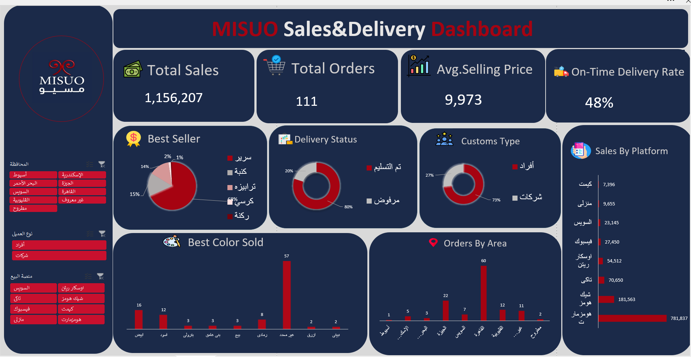

# MISUO Sales & Delivery Dashboard 📊

An interactive Sales & Delivery Dashboard built using Microsoft Excel to analyze sales performance, customer behavior, delivery performance, and operational trends.

---

## 📌 Project Overview

This project focuses on analyzing sales and operations data to provide a clear overview of business performance.

The dashboard transforms raw transactional data into interactive visual insights using Excel PivotTables, PivotCharts, and Slicers.

Users can interact with the dashboard by filtering the data based on different dimensions such as region, customer type, and sales platform.

---

## 🎯 Project Objectives

The main objectives of this dashboard are to:

- Monitor overall sales performance.
- Track the number of orders.
- Analyze average selling price.
- Measure on-time delivery performance.
- Identify best-selling products.
- Analyze sales performance across different platforms.
- Compare orders across different areas.
- Understand customer type distribution.
- Analyze the most frequently sold colors.
- Provide an interactive and easy-to-use business dashboard.

---

## 🛠️ Tools & Technologies

- Microsoft Excel
- PivotTables
- PivotCharts
- Slicers
- Excel Formulas
- Data Cleaning
- Data Analysis
- Dashboard Design

---

## 📊 Dashboard KPIs

The dashboard provides several key performance indicators:

| KPI | Description |
|---|---|
| Total Sales | Total sales value |
| Total Orders | Total number of orders |
| Average Selling Price | Average price of products sold |
| On-Time Delivery | Percentage/status of orders delivered on time |

---

## 📈 Dashboard Analysis

The dashboard includes visualizations for:

### 🏆 Best Seller
Identifies the best-performing products based on sales/order performance.

### 🎨 Best Color Sold
Shows the most frequently sold product colors.

### 🚚 Delivery Status
Provides an overview of delivery performance and on-time delivery.

### 👥 Customer Type
Analyzes the distribution of different customer types.

### 📍 Orders by Area
Shows the distribution of orders across different geographical areas.

### 💻 Sales by Platform
Compares sales/order activity across different sales platforms.

---

## 🎛️ Interactive Filters

The dashboard includes interactive Slicers that allow users to filter the analysis by:

- Region / Area
- Customer Type
- Sales Platform

When a filter is selected, the KPIs and charts update dynamically.

---

## 🖼️ Dashboard Preview



---

## 📂 Project Structure

```text
MISUO-Sales-Operations-Dashboard/
│
├── MISUO_Sales_Operations_Dashboard.xlsx
├── Dashboard.png
└── README.md
